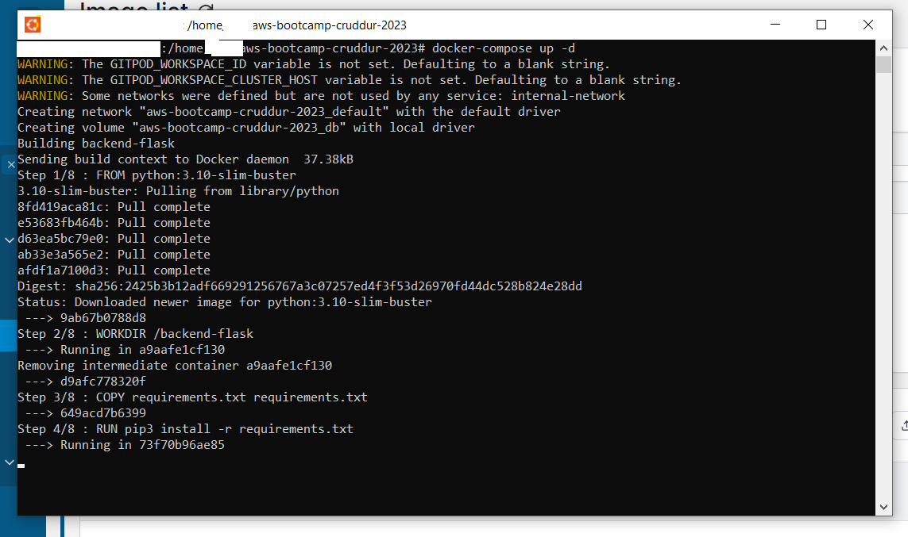
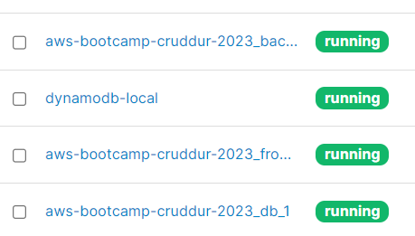
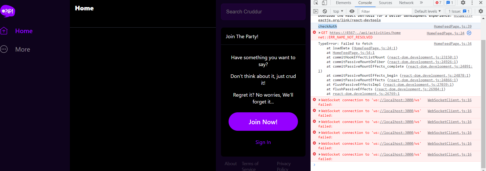
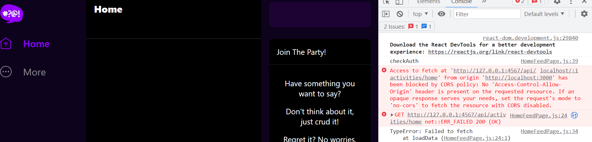
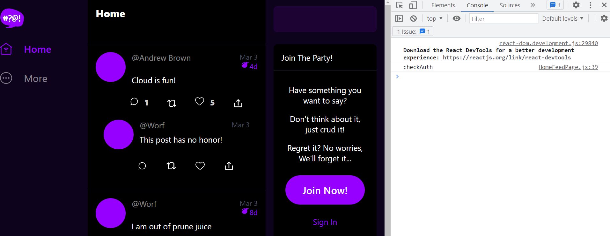
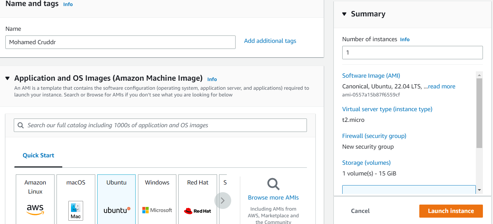
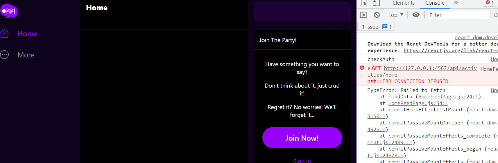
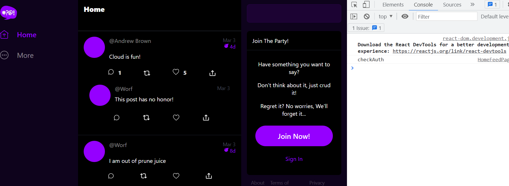

# Week 1 — App Containerization

- Docker images:
Dockerfile.new files in both the backend and frontend are made based on the security concerns shown by Snyk.
Dockerfile.multistage in the frontend is made so that it can reduce the size of the docker image created

the multistage's size is 10.04 MB [dockerhub](https://hub.docker.com/layers/devopscloud101/multistage-frontend-react-js/v1/images/sha256-3baf831b8e5ac700ecdc9cf65ba9809bb292a0c17cda2f818ec160167bbefd90?context=repo) compared to the base image 394.23 MB [dockerhub](https://hub.docker.com/layers/devopscloud101/frontend-react-js/v1/images/sha256-d2d126091b064020e4f98fb26d7df72a211803306aef6e715b3c8c952d92675c?context=repo)

[my dockerhub repo](https://hub.docker.com/repositories/devopscloud101)

- running the app locally

- had 2 errors which I resolved

- Problem #1
The links in docker-compose needed an update, so that it could work locally

- Problem #2
CORS problem resolved by installing a browser extension

- The final product

# Running the app on an EC2 instance
- I chose the free tier EC2 instance T2.micro

- Used the .local version of docker-compose. Everything worked but the frontend didn't have access to data

- So i've solved the issue by adding the ip address of the EC2 instance (check the .ec2 version of docker-compose)
